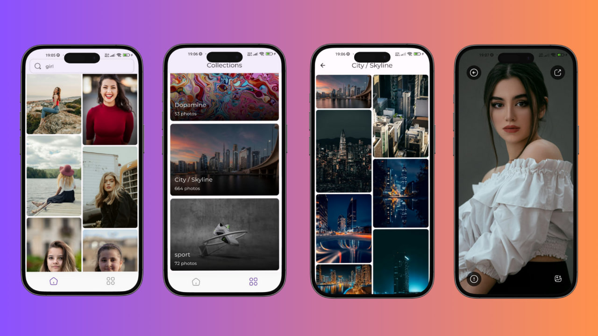

# unsplash_app

# Unsplash - Free high-resolution photos and images
Purpose: The primary destination for high-quality, royalty-free images and photos for personal or commercial use. Discover stunning images from talented photographers from around the world to inspire and enhance your creative projects.
Background:
Unsplash offers an extensive library of over 2 million high-resolution images contributed by a global community of photographers. Whether you're a designer, marketer, developer, or content creator, Unsplash provides the perfect images to fuel your imagination.
Features:
1. Huge Collection: Explore a collection of over 2 million free photos in a variety of categories, including nature, architecture, people, technology, and more.
2. High quality: Every image on Unsplash is carefully selected and quality checked, ensuring that you can use high-quality visuals for your projects.
3. Free to Use: All images on Unsplash are licensed under the Creative Commons Zero (CC0) license, which allows them to be freely downloaded, modified, and used for personal and commercial purposes without copyright.
4. Search and Discover: Find the perfect image quickly and easily with our powerful search engine. Filter by keyword, category, color, direction, and more to refine your results and find exactly what you're looking for.
5. Collections: Browse curated photo collections created by our team of editors, showcasing the best photos from a variety of subjects and themes.
6. Community of Contributors: Join our global community of photographers and artists by contributing your photos to Unsplash. Share your work with millions of users around the world and get to know your portfolio.
7. API Access: Integrate Unsplash directly into your apps, websites or products with our robust API. Programmatically access millions of high-quality images to enhance your user experience.
How to use Unsplash:
1. Search: Enter keywords or browse categories to find images that match your project requirements.
2. Download: Download the images of your choice in high resolution with a simple click. No registration or account required.
3. Attribution: Although optional, we encourage users to credit the photographers they work with as a token of appreciation for their talent and contribution to the community.
4. Share and Enjoy: Use Unsplash images in projects, presentations, social media posts, websites, and more. Share your creations with the world and inspire others with your vision.
Start:
Visit Unsplash.com today to start exploring our collection of high-resolution photos and unleash your creativity. Join our community of millions of users and experience the power of visual storytelling with Unsplash.
Libraries used:
http: ^0.13.3
logger: ^2.1.0
cached_network_image: ^3.3.1
image_picker: ^1.0.7
flutter_staggered_grid_view: ^0.7.0
iconsax: ^0.0.8
image_gallery_saver: '^2.0.3'
dio: ^5.4.1
url_launcher: ^6.2.4
font_awesome_flutter: ^10.7.0
fluttertoast: ^8.2.4
path_provider: ^2.1.2
http_interceptor: ^1.0.2
share_plus: ^7.2.2
